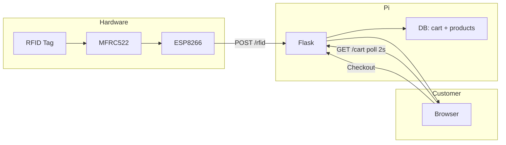
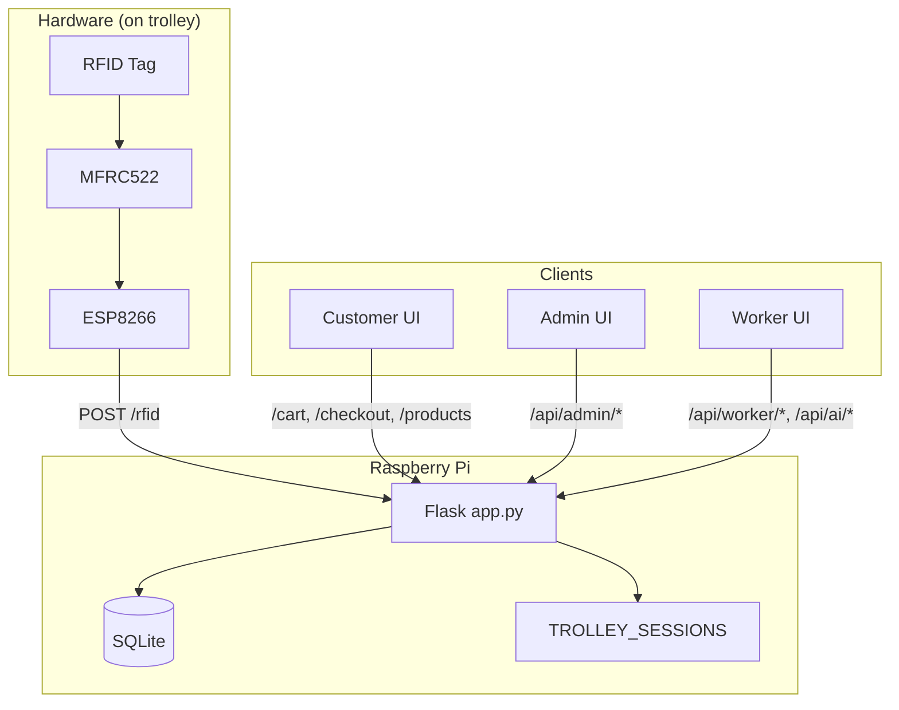

# Smart Trolley System — Technical Documentation

This document describes how the Smart Trolley system works: architecture, RFID detection with the Raspberry Pi, algorithms, and workflows, including block diagrams.

---

## Project documentation (other files)

| File | Description |
|------|-------------|
| **[AUTOSTART_PI.md](AUTOSTART_PI.md)** | Auto-start the backend (customer-frontend) when the Raspberry Pi reboots; systemd service and optional kiosk browser. |
| **[PROGRAMMING_LANGUAGES.md](PROGRAMMING_LANGUAGES.md)** | Programming languages used in the project with line counts and percentages. |
| **[SETUP_AND_DEPLOYMENT.md](SETUP_AND_DEPLOYMENT.md)** | Setup and deployment: Pi backend, ESP8266 + MFRC522 wiring and config, running the app, frontend URLs. |
| **[PROMOTION_SYSTEM.md](PROMOTION_SYSTEM.md)** | How promotions work: spin wheel (once per session) and banner ads (30‑minute rotation). |
| **SYSTEM_DOCUMENTATION.md** (this file) | Architecture, algorithms, RFID flow, block diagrams. |

---

## 1. System Overview

The Smart Trolley is a supermarket cart system where:

- **Products** are tagged with **RFID**; when a customer places an item near the trolley reader, the item is added to the cart automatically.
- The **RFID reader** (ESP8266 + MFRC522) sends the tag UID to the **backend** (Flask on Raspberry Pi).
- The **backend** looks up the product by UID, updates the **cart** in the database, and returns the updated cart.
- **Customer**, **Admin**, and **Worker** frontends talk to the same backend for shopping, management, and operations.

---

## 2. High-Level Block Diagram

```
┌─────────────────────────────────────────────────────────────────────────────────┐
│                        SMART TROLLEY SYSTEM — HIGH LEVEL                          │
└─────────────────────────────────────────────────────────────────────────────────┘

  ┌──────────────┐     WiFi      ┌─────────────────────────────────────────────────┐
  │   RFID       │   HTTP POST   │              RASPBERRY PI                        │
  │  ESP8266 +   │ ────────────► │  ┌─────────────────────────────────────────────┐ │
  │  MFRC522     │   /rfid       │  │           FLASK BACKEND (app.py)            │ │
  │  (on cart)   │               │  │  • /rfid, /cart, /checkout, /products        │ │
  └──────────────┘               │  • Admin/Worker APIs, Analytics, Alerts         │ │
                                 │  └──────────────────┬──────────────────────────┘ │
                                 │                     │                            │
                                 │  ┌──────────────────▼──────────────────────────┐ │
                                 │  │         SQLite DB (database.db)              │ │
                                 │  │  products | cart | sales | promotions |       │ │
                                 │  │  ui_settings | staff_audit.jsonl             │ │
                                 │  └──────────────────────────────────────────────┘ │
                                 └─────────────────────┬───────────────────────────┘
                                                       │
         ┌────────────────────────────────────────────┼────────────────────────────────────────────┐
         │                              HTTP (same Pi or LAN)                                         │
         ▼                              ▼                              ▼                              ▼
  ┌──────────────┐              ┌──────────────┐              ┌──────────────┐              ┌──────────────┐
  │  CUSTOMER    │              │    ADMIN     │              │   WORKER      │              │  (Optional)  │
  │  FRONTEND    │              │  FRONTEND    │              │  FRONTEND     │              │  Android App │
  │  Browse,     │              │  Dashboard,  │              │  Scan items,  │              │              │
  │  Cart,       │              │  Inventory,  │              │  Add products │              │              │
  │  Checkout    │              │  Alerts,     │              │  AI design    │              │              │
  │              │              │  Trolleys    │              │               │              │              │
  └──────────────┘              └──────────────┘              └──────────────┘              └──────────────┘
```

---

## 3. RFID Detection and Pi Integration

### 3.1 Hardware Flow (Block Diagram)

```
┌─────────────────────────────────────────────────────────────────────────────────┐
│                    RFID DETECTION — HARDWARE TO PI                                │
└─────────────────────────────────────────────────────────────────────────────────┘

  ┌─────────────┐     SPI      ┌─────────────┐     WiFi      ┌─────────────────────┐
  │  RFID TAG   │ ◄──────────► │   MFRC522   │               │   RASPBERRY PI      │
  │  (on product)│             │   Reader    │               │   IP: 10.128.x.x    │
  └─────────────┘              └──────┬──────┘               │   Port: 5000        │
                                       │                      │                     │
                                       │                      │  Flask app.py      │
                                       │                      │  POST /rfid        │
                                       │                      └─────────▲──────────┘
                                       │                                │
                                       │         ┌──────────────────────┘
                                       │         │  HTTP POST
                                       │         │  Body: {"uid":"03563B38","trolley_id":"T01"}
                                       ▼         │
                              ┌─────────────────┴─────┐
                              │      ESP8266          │
                              │  • Reads UID (hex)    │
                              │  • Cooldown 800 ms    │
                              │  • Sends to Pi        │
                              └───────────────────────┘
```

### 3.2 RFID Algorithm (ESP8266)

| Step | Action |
|------|--------|
| 1 | Loop: check `PICC_IsNewCardPresent()` then `PICC_ReadCardSerial()`. |
| 2 | **Anti-duplicate**: If `(now - lastReadTime) < 800 ms`, halt and return (avoid same tap adding multiple times). |
| 3 | Build UID string from `uid.uidByte[]` as hex (e.g. `03563B38`), uppercase. |
| 4 | HTTP POST to `http://<PI_IP>:5000/rfid` with JSON `{"uid": "<UID>", "trolley_id": "T01"}`. |
| 5 | Halt card, stop crypto, delay 300 ms for stability, then loop again. |

### 3.3 Backend RFID Endpoint (Pi / Flask)

When the Pi receives `POST /rfid`:

1. **Frozen check**: If product UID is in admin’s “frozen” list → return `403` (item blocked).
2. **Lookup**: `db.get_product(uid)`; if not found → return `404`.
3. **Add to cart**: `db.add_to_cart(uid)` (insert or increment qty).
4. **Heartbeat**: `update_trolley_heartbeat(cart)`.
5. Return `200` with updated `cart` in JSON.

So **RFID detection** = ESP8266 reads tag → sends UID to Pi → Pi validates and adds to cart → cart state lives in SQLite on the Pi.

---

## 4. System Workflow (End-to-End)

### 4.1 Customer Shopping Workflow



**Sequence:**

1. Customer picks product (RFID tag on product).
2. ESP8266 detects tag → sends UID to Pi `/rfid`.
3. Backend adds/increments item in `cart`, updates trolley heartbeat, returns cart.
4. Customer screen polls `GET /cart` every 2 s → sees live cart and total.
5. Customer can remove items via `POST /cart/remove`.
6. At checkout: `POST /checkout` → `record_sale()` → update stock, clear cart, clear trolley session.

### 4.2 Cart and Checkout Algorithms

**Add to cart (by product ID):**

- If product already in `cart` table → `UPDATE cart SET qty = qty + 1`.
- Else → `INSERT INTO cart (product_id, qty) VALUES (pid, 1)`.

**Remove from cart:**

- If `qty > 1` → `UPDATE cart SET qty = qty - 1`.
- Else → `DELETE FROM cart WHERE product_id = pid`.

**Checkout:**

- Compute total from cart using `final_price` (after per-item discount %).
- Optional discount: `final_total = total * (1 - discount_percent/100)`.
- Insert into `sales` (timestamp, total, items JSON).
- For each cart item: `UPDATE products SET stock = MAX(0, stock - qty)`.
- `DELETE FROM cart`; clear in-memory trolley session for T001.

### 4.3 Trolley Heartbeat (In-Memory on Pi)

- **Purpose**: Let admin see “is the trolley in use?” and “last activity”.
- **When updated**: On every `/rfid`, `/cart`, `/cart/remove`, and `GET /cart`.
- **Structure**: `TROLLEY_SESSIONS['T001'] = { last_beat, item_count, total, customer }`.
- **Trolley status (for admin):**
  - `delta < 60 s` → **Online**
  - `60 s ≤ delta < 300 s` → **Idle**
  - `delta ≥ 300 s` → **Abandoned**

---

## 5. Algorithms Summary

| Component | Algorithm / Logic |
|-----------|-------------------|
| **RFID dedup** | Cooldown 800 ms on ESP8266; one HTTP POST per valid read. |
| **Product lookup** | UID (e.g. `03563B38`) = primary key in `products`; used for cart and freeze check. |
| **Cart** | Add = upsert (insert or qty+1); Remove = qty-1 or delete; single global cart. |
| **Pricing** | `final_price = price * (1 - discount/100)`; total = Σ (final_price × qty). |
| **Checkout** | Persist sale, decrease stock, clear cart, clear T001 session. |
| **Heartbeat** | On any cart read/write: update T001’s last_beat, item_count, total. |
| **Alerts** | **Inventory**: stock=0 → high; stock<5 → medium. **Security**: audit log rules (e.g. manual zero stock, product delete). **Operations**: trolley idle >5 min and total >500 → abandoned cart alert. |
| **Analytics** | Today vs yesterday sales; daily (7 days), hourly (8–22), weekly (8 weeks), monthly (12 months); category totals from sales items; recent sales list. |
| **Promotions** | **Spin wheel**: one per session (sessionStorage). **Banner**: rotate by 30‑min slot; `get_current_promotion()` picks spin wheel first, else banner. |

---

## 6. Data Flow Block Diagram

```
┌─────────────────────────────────────────────────────────────────────────────────┐
│                         DATA FLOW — KEY ENTITIES                                  │
└─────────────────────────────────────────────────────────────────────────────────┘

  RFID UID ──► products (lookup) ──► cart (add/update)
                      │                      │
                      │                      ├──► get_cart_items() ──► Customer UI
                      │                      └──► TROLLEY_SESSIONS (heartbeat)
                      │
  checkout ──► sales (insert) ──► products (stock decrease)
            └──► cart (clear)
            └──► TROLLEY_SESSIONS (clear T001)

  Admin ──► products CRUD, ui_settings, frozen_products, emergency reset cart
  Worker ──► add product (RFID id), AI design (promotions)
  Alerts ──► products (stock), staff_audit.jsonl (anomaly), TROLLEY_SESSIONS (abandoned)
```

---

## 7. Database Schema (Logical)

- **products**: id (RFID UID), name, unit, price, stock, category, image, discount, promotion fields, last_updated.
- **cart**: product_id (FK), qty — single cart for the single trolley.
- **sales**: id, timestamp, total, items (JSON).
- **promotions**: type (banner/spin_wheel), title, content (JSON), active, created_at, last_shown.
- **ui_settings**: key-value (theme, app_name, frozen_products, etc.).

---

## 8. Deployment Context (Pi)

- **Raspberry Pi** runs the Flask app (`app.py`) and SQLite (`database.db`).
- **Config**: `backend/config.py` — `HOST='0.0.0.0'`, `PORT=5000` so the Pi is reachable on the LAN.
- **ESP8266** must use the **Pi’s IP** in `serverUrl` (e.g. `http://10.128.199.147:5000/rfid`). Update this when the Pi’s IP changes.
- Customer/Admin/Worker UIs are served by the same Flask app and access it via the Pi’s IP (or localhost if on the Pi).

---

## 9. Summary Diagram — All Components



This document and the block diagrams describe how the system works: **RFID detection** (ESP8266 + MFRC522 → Pi), **cart and checkout algorithms**, **trolley heartbeat**, **alerts and analytics**, and **end-to-end workflow** on the Raspberry Pi.

---

## 10. Alternative Block Diagrams (ASCII Only)

If Mermaid is not available, use these ASCII equivalents.

### 10.1 System components (ASCII)

```
                    [ RFID TAG ]  <-->  [ MFRC522 ]  <-->  [ ESP8266 ]
                                                            |
                                                            | WiFi HTTP POST
                                                            v
[ Customer ]  [ Admin ]  [ Worker ]  <---------->  [ RASPBERRY PI ]
                                                           |
                                                    [ Flask Backend ]
                                                           |
                                                    [ SQLite DB ]
                                                    [ TROLLEY_SESSIONS ]
```

### 10.2 RFID to cart (ASCII)

```
  Product with RFID
         |
         v
  MFRC522 reads UID  -->  ESP8266 (cooldown 800ms)  -->  POST /rfid (Pi)
                                                               |
                                                               v
  Frozen? --Yes--> 403    Product found? --No--> 404    add_to_cart(uid)
                                                               |
                                                               v
  update_trolley_heartbeat()  -->  return cart JSON  -->  Customer UI (poll /cart)
```
